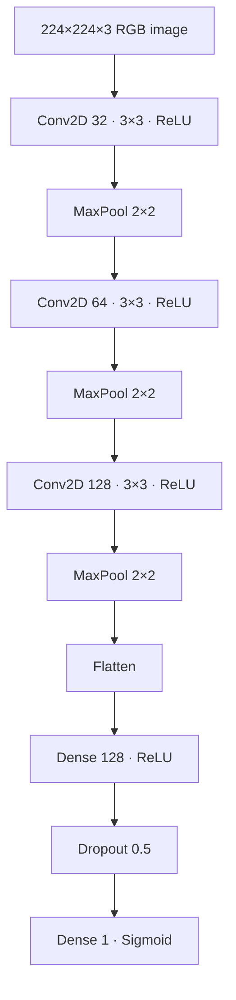

# Cats vs Dogs CNN

> TensorFlow/Keras convolutional neural network for binary cat-vs-dog image classification with augmentation, validation, and explicit generalization analysis.

[](https://perpsakach.github.io/)


## Overview

This project trains a custom convolutional neural network on a recovered 20,000-image binary classification dataset:

- 10,000 cat images
- 10,000 dog images
- 224×224 RGB preprocessing
- 80/20 train-validation split

The portfolio explicitly distinguishes **training performance** from **validation/generalization performance** rather than presenting the highest number as model accuracy.

## Model architecture



## Recovered experiment configuration

| Parameter | Value |
|---|---|
| Input size | 224×224 RGB |
| Normalization | pixel / 255.0 |
| Labels | cat = 0, dog = 1 |
| Split | 80/20 |
| Random state | 42 |
| Optimizer | Adam |
| Learning rate | 0.001 |
| Loss | Binary cross-entropy |
| Batch size | 32 |
| Epochs | 10 |
| Dropout | 0.5 |

### Recovered augmentation

```text
rotation          ±20°
width shift       0.1
height shift      0.1
zoom              0.1
horizontal flip   enabled
fill mode         nearest
```

## Recovered final metrics

| Metric | Training | Validation |
|---|---:|---:|
| Accuracy | **97.23%** | **82.30%** |
| Loss | **0.0760** | **0.6565** |

### Interpretation

The ~14.9 percentage-point accuracy gap, together with the large loss divergence, indicates substantial overfitting.

The correct technical conclusion is:

> The CNN fit the training data strongly but generalized materially worse to validation data.

That is more defensible than reporting "97% accuracy" without qualification.

## Why the model likely overfit

Potential contributors include:

- large parameter count after `Flatten`;
- limited regularization beyond one Dropout layer;
- no batch normalization in the recovered architecture;
- custom CNN features rather than pretrained ImageNet representations.

## Improvement path

A stronger follow-up experiment would benchmark:

- `GlobalAveragePooling2D` instead of `Flatten`;
- batch normalization;
- L2 regularization;
- learning-rate scheduling;
- early stopping;
- transfer learning with EfficientNet, MobileNet, or ResNet.

## Evaluation beyond accuracy

The reconstructed evaluation layer supports or recommends:

- precision;
- recall;
- F1-score;
- confusion matrix;
- ROC-AUC;
- inspection of false-positive and false-negative examples.

## Run

```bash
pip install -r requirements.txt
python train.py --data path/to/train
```

Expected dataset layout:

```text
train/
├── cats/
└── dogs/
```

## What this project demonstrates

- image preprocessing
- CNN architecture design
- data augmentation
- binary classification
- TensorFlow/Keras training
- model evaluation
- overfitting diagnosis
- generalization reasoning

## Provenance

- **RECOVERED** — dataset size, architecture, augmentation, training configuration, and logged train/validation metrics
- **RECONSTRUCTED** — current source implementation
- **ENHANCED** — modern evaluation, tests, callbacks, and portfolio documentation

See [`PROVENANCE.md`](PROVENANCE.md).

## Portfolio

Explore the complete technical portfolio at **[perpsakach.github.io](https://perpsakach.github.io/)**.