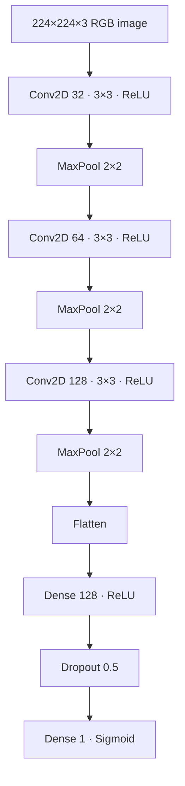

# Cats vs Dogs CNN

> Transparent TensorFlow/Keras reconstruction of a historical cat-vs-dog CNN experiment, enhanced with streaming input pipelines, structured evaluation, integrity checks, reproducible configuration, tests, linting, dependency auditing, and CI.

[](https://github.com/PerpsAkach/cats-vs-dogs-cnn/actions/workflows/ci.yml)
[](https://perpsakach.github.io/)


## Overview

The historical experiment used a balanced **20,000-image** dataset:

- 10,000 cat images;
- 10,000 dog images;
- 224×224 RGB preprocessing;
- 80/20 train-validation split;
- a custom three-stage CNN;
- geometric data augmentation;
- 10 training epochs with Adam and binary cross-entropy.

The current repository reconstructs that supported design but does **not** claim that the original image files or literal original source code are present. It also keeps the historical logged metrics clearly separate from current runtime/CI validation.

## Recovered historical result

| Metric | Training | Validation |
|---|---:|---:|
| Accuracy | **97.23%** | **82.30%** |
| Loss | **0.0760** | **0.6565** |

The approximately **14.9 percentage-point accuracy gap**, together with the materially higher validation loss, is evidence of substantial overfitting in the recovered experiment.

The technically appropriate interpretation is:

> The CNN fit the training set strongly but generalized materially worse to the validation set.

The 97.23% figure is therefore **training accuracy**, not an unqualified model-accuracy claim.

## Architecture



## Recovered experiment configuration

| Parameter | Value |
|---|---|
| Input size | 224×224 RGB |
| Normalization | pixel / 255.0 |
| Labels | cat = 0, dog = 1 |
| Split | 80/20 |
| Random state | 42 |
| Optimizer | Adam |
| Learning rate | 0.001 |
| Loss | Binary cross-entropy |
| Batch size | 32 |
| Epochs | 10 |
| Dropout | 0.5 |

### Recovered augmentation

```text
rotation          ±20°
width shift       0.1
height shift      0.1
zoom              0.1
horizontal flip   enabled
fill mode         nearest
```

## Current engineering enhancements

### Memory-efficient data pipeline

The reconstructed training path uses `tf.keras.utils.image_dataset_from_directory` and `tf.data` rather than loading all images into one large NumPy tensor. This makes the workflow much more practical for a 20,000-image-scale dataset.

The loader also fixes the class ordering explicitly:

```text
cats → 0
dogs → 1
```

so labels do not depend on incidental filesystem ordering.

### Dataset validation

Before training, the repository can validate:

- dataset-root existence;
- required `cats/` and `dogs/` directories;
- presence of both classes;
- supported image extensions;
- optional image integrity using `--verify-images`.

See [`docs/INPUT_CONTRACT.md`](docs/INPUT_CONTRACT.md).

### Evaluation beyond accuracy

The current evaluation layer calculates:

- accuracy;
- precision;
- recall;
- F1-score;
- ROC-AUC when both classes are present;
- a fixed 2×2 confusion matrix;
- per-class classification-report statistics.

This provides a more useful validation picture than a single accuracy number.

### Structured run artifacts

A successful run can write:

```text
outputs/
├── cats_dogs_cnn.keras
├── training_history.csv
├── validation_metrics.json
├── confusion_matrix.csv
├── classification_report.json
└── run_manifest.json
```

See [`docs/OUTPUT_CONTRACT.md`](docs/OUTPUT_CONTRACT.md).

### Training safeguards

The current implementation includes:

- validated runtime configuration;
- deterministic Python/NumPy/TensorFlow seeds;
- early stopping on validation loss;
- best-validation-loss checkpointing;
- configurable epochs, batch size, learning rate, and validation fraction.

## Run

Install dependencies:

```bash
python -m pip install -r requirements.txt
```

Expected dataset layout:

```text
train/
├── cats/
│   └── ...
└── dogs/
    └── ...
```

Train with defaults:

```bash
python train.py --data path/to/train
```

Verify image integrity before training:

```bash
python train.py \
  --data path/to/train \
  --verify-images
```

Customize the run:

```bash
python train.py \
  --data path/to/train \
  --epochs 10 \
  --batch-size 32 \
  --learning-rate 0.001 \
  --validation-fraction 0.20 \
  --output-dir outputs
```

## CI and quality gates

GitHub Actions separates lightweight cross-version validation from the heavier TensorFlow runtime job:

```text
Python 3.11 / 3.12 / 3.13
        ↓
configuration + data + evaluation tests
        ↓
source compilation

TensorFlow runtime job (Python 3.12)
        ↓
full dependency installation
        ↓
TensorFlow import compatibility
        ↓
full test suite + CLI validation

Ruff linting        → separate quality gate
pip-audit           → separate dependency-security gate
```

The CI workflow does not download or train on the historical 20,000-image dataset. Passing CI validates the implementation and runtime surface; it does not reproduce the historical experiment result.

## Why the historical model likely overfit

Potential contributors include:

- the large parameter count introduced by `Flatten`;
- limited regularization beyond a single Dropout layer;
- no batch normalization in the recovered architecture;
- learning image features from scratch instead of using pretrained ImageNet representations.

## Improvement path

A scientifically useful follow-up benchmark would compare the recovered architecture against:

- `GlobalAveragePooling2D` instead of `Flatten`;
- batch normalization;
- L2 regularization;
- learning-rate scheduling;
- transfer learning with EfficientNet, MobileNet, or ResNet.

Those experiments are **not currently claimed as implemented results**.

## Repository structure

```text
.github/workflows/ci.yml   CI, lint, runtime and dependency-security gates
src/config.py              validated runtime configuration
src/data.py                discovery, validation and streaming dataset construction
src/model.py               reconstructed CNN and augmentation builders
src/evaluation.py          structured binary-classification evaluation
train.py                   training/evaluation CLI

tests/                     automated unit/runtime tests
docs/INPUT_CONTRACT.md     dataset assumptions and validation rules
docs/OUTPUT_CONTRACT.md    output artifact definitions
IMPLEMENTATION_STATUS.md   implemented/not-claimed boundary
PROVENANCE.md              recovered/reconstructed/enhanced evidence boundary
```

## Provenance

This repository uses explicit provenance labels:

- **RECOVERED** — supported historical configuration and logged experiment results;
- **RECONSTRUCTED** — current implementation rebuilt from the supported design;
- **ENHANCED** — modern engineering improvements added for portfolio quality;
- **NOT CLAIMED / UNVERIFIED** — capabilities or results without supporting evidence.

See [`PROVENANCE.md`](PROVENANCE.md) and [`IMPLEMENTATION_STATUS.md`](IMPLEMENTATION_STATUS.md).

## What this project demonstrates

- computer-vision data preparation;
- convolutional neural-network architecture design;
- augmentation and binary classification;
- TensorFlow/Keras engineering;
- memory-conscious input pipelines;
- validation metrics and diagnostics;
- overfitting/generalization reasoning;
- reproducibility and provenance discipline;
- automated testing, linting, dependency auditing, and CI.

## Portfolio

Explore the complete technical portfolio at **[perpsakach.github.io](https://perpsakach.github.io/)**.
